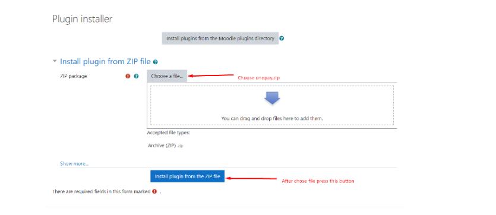
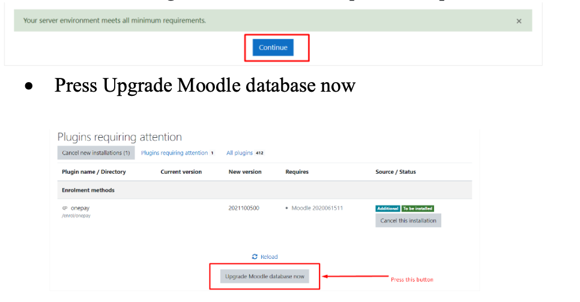
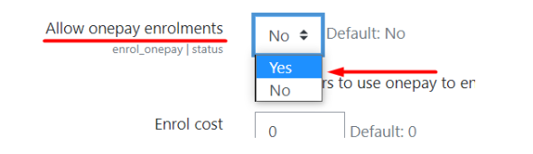
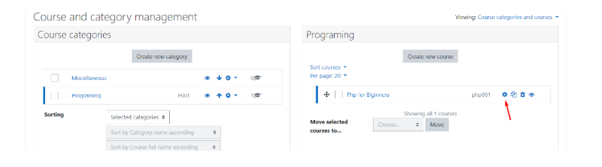
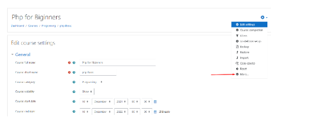
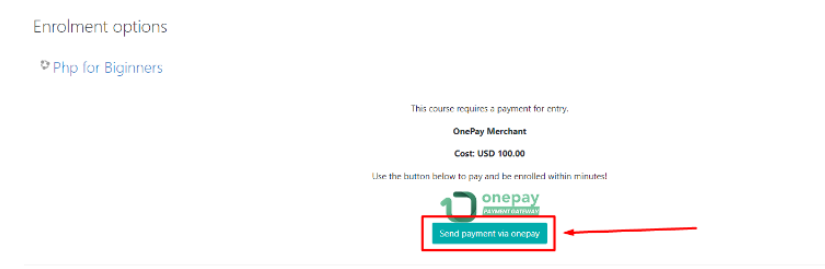

# onepay-moodle

**Onepay Moodle Plugin  Documentation** 

**Moodle Version : 3.11.4 or higher** 

**Install**  

- Go to Site Administration -> Plugins ->Enrolments->[Install ](http://203.94.66.253:8080/LMS/admin/settings.php?section=manageenrols)Plugin 

- After validation Success press Continue to go forward 

- If moodle Plugin meet Minimum requirements press Continue to proceed 

- Press Upgrade Moodle database now 

- Press Continue  

- Fill Onepay Merchant App Details (If do not have onepay merchant account, you need to request new account from onepay) 

**Enable Onepay for enrolment** 

- Go to Site Administration -> Plugins ->Enrolments->[Manage enrol plugins ](http://203.94.66.253:8080/LMS/admin/settings.php?section=manageenrols)

- Go to one pay and press eye mark to enable plugin 
- Go to setting and Set Allow onepay enrolments to Yes 

**Add Enrolment Method for the Course** 

- site Administration->Course->Manage Course and Categories 
- Select setting of Course  

- Select More from the menu 

- go to user -> enrolment methods 

find onepay from add method and select 

- fill required fields and press Add method 

**Student Enrol for the course** 

- Select a course that you want to enrol and press Send Payment via onepay 
- After press this button you will redirect to payment process. (Please don’t refresh or close the tab) 

If payment success, you will redirect to course page with success message.  

Good Luck, now you can access course materials **Error Meassages** 

1. Onepay Merchant App details not provide by the system administrator** 

2. Payment Not Success 

